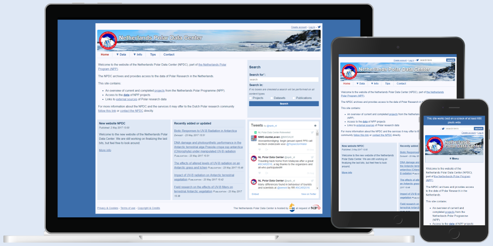

**Features:**

- Project descriptions
- Dataset descriptions according to GCMD standards
- Publication descriptions
- Responsive

**Dependencies:**
- Apache or nginx
- php 7.0
  - curl
  - gd
  - xml
  - zip
- mysql of mariadb (other systems require work on datamodel)
- composer

**For generating compressed js/css**
- visual studio code
  - Easy Sass
  - minify
- sass

**To be documented**
- IFTTT hook for twitter
- how to run cron
- creating first user account
- instruction on creating own css